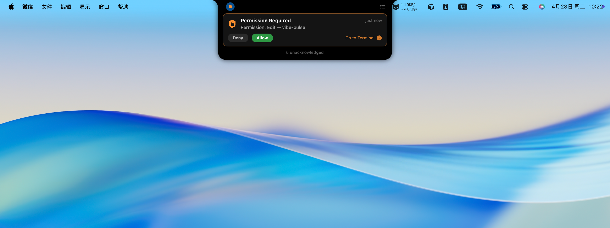

<div align="center">

# Vibe Pulse

**Smart Notification Center for Claude Code CLI**

A macOS native app that turns your MacBook's notch into a Dynamic Island-style notification hub for [Claude Code](https://docs.anthropic.com/en/docs/claude-code). Get real-time alerts for permission requests and task completions — without constantly watching your terminal.

[](https://swift.org)
[](https://www.apple.com/macos/)
[](LICENSE)

English | [中文](README_CN.md)

</div>

---

## Screenshots

<table>
  <tr>
    <td align="center"><br /><b>Idle</b><br />Green dot — all sessions complete</td>
    <td align="center"><br /><b>Processing</b><br />Blue breathing dot — Claude is working</td>
  </tr>
  <tr>
    <td align="center"><br /><b>Task Completed</b><br />Green card — auto-closes in 3 seconds</td>
    <td align="center"><br /><b>Permission Card — Allow / Deny</b><br />Respond to permission requests directly from the notch without switching to the terminal</td>
  </tr>
  <tr>
    <td align="center" colspan="2"><br /><b>Notification Timeline</b><br />Click the notch to browse recent events</td>
  </tr>
</table>

---

## Who Is This For?

- Developers who use Claude Code CLI for everyday vibe coding
- Developers who frequently switch to browsers, docs, or chat while Claude Code runs
- MacBook users (with notch display) on macOS

## Why Vibe Pulse?

When vibe coding with Claude Code, you're often multitasking — browsing docs, reviewing designs, or grabbing coffee. Meanwhile, Claude might be:

- Waiting for your permission to run a command
- Done with a task and waiting for your next instruction
- Asking you a question

**Vibe Pulse watches Claude Code for you** and delivers just-in-time notifications through your MacBook's notch area, so you never miss what matters.

## Features

### Smart Event Detection
Automatically detects events from Claude Code sessions via the [hooks system](https://docs.anthropic.com/en/docs/claude-code/hooks):

| Event | Detection Method |
|---|---|
| Permission requests | Claude Code `PermissionRequest` hook |
| Task completion | Claude Code `Stop` hook |
| Claude asking | `Notification` hook (idle prompt) |
| Test passed | Regex analysis of stdout (pytest, Jest, XCTest, Go test, cargo test) |

### Three-Tier Notification System

| Level | Behavior | Sound | Example |
|---|---|---|---|
| **Silent** | Record to timeline only | None | Tests passed |
| **Remind** | Pop notch card, auto-close in 3s | Soft (Tink) | Task completed, Claude asking |
| **Alert** | Persistent card until user acts | Strong (Sosumi) | Permission request |

### Dynamic Status Indicator

The notch status dot changes color based on what's happening:

| Color | Meaning |
|---|---|
| 🟢 Green | Idle / task completed |
| 🔵 Blue | Claude is processing |
| 🟠 Orange | Permission request waiting |
| ⚪ Gray | No active sessions |

### Smart Notification Suppression

When you're already in the terminal, Vibe Pulse stays silent — no redundant notifications when you're already watching Claude work.

### One-Click Jump to Terminal

Every notification card has a "Go to Terminal" button that takes you directly to the right terminal window/tmux pane for that Claude session.

### Multi-Session Tracking

Track multiple Claude Code sessions simultaneously. Each session maintains its own state, and the notch shows the most urgent status across all sessions.

## Supported Environments

**Terminals:** Apple Terminal, iTerm2, Ghostty, Warp

**Multiplexers:** tmux (auto-detects panes)

**Test Frameworks (pass detection):** pytest, Jest, Vitest, Mocha, XCTest, Go test, cargo test, RSpec, PHPUnit, and more (19 patterns)

## Getting Started

### Prerequisites

- macOS 15.0 (Sequoia) or later
- Swift 6.0+
- [Claude Code](https://docs.anthropic.com/en/docs/claude-code) installed

### Build & Run

```bash
git clone https://github.com/LMseventeen/vibe-pulse.git
cd vibe-pulse
swift run VibePulse
```

On first launch, Vibe Pulse automatically installs its hooks into `~/.claude/settings.json`. No manual configuration needed.

### Verify Installation

After launching, you should see a small status dot near your MacBook's notch. Start a Claude Code session and the dot will turn green/blue to indicate it's tracking.

## Architecture

```
Claude Code CLI
     │
     ▼ (hooks)
┌─────────────┐     Unix Socket      ┌──────────────────┐
│  Hook Script │ ──────────────────▶  │   Vibe Pulse App │
│  (Python)    │  /tmp/claude-pulse   │                  │
└─────────────┘       .sock           │  ┌────────────┐  │
                                      │  │  Capture    │  │
                                      │  └─────┬──────┘  │
                                      │        ▼         │
                                      │  ┌────────────┐  │
                                      │  │ Classifier  │  │
                                      │  └─────┬──────┘  │
                                      │        ▼         │
                                      │  ┌────────────┐  │
                                      │  │   Queue     │  │
                                      │  └─────┬──────┘  │
                                      │        ▼         │
                                      │  ┌────────────┐  │
                                      │  │  Notch UI   │  │
                                      │  └────────────┘  │
                                      └──────────────────┘
```

**Zero dependencies.** Built entirely with Apple frameworks (SwiftUI, AppKit, Combine). No third-party packages.

### Key Design Decisions

- **Regex over LLM** — Sub-millisecond stdout analysis using pattern matching, not AI inference
- **Actor-based concurrency** — Swift actors (`PulseStore`, `EventClassifier`, `NotificationQueue`) for thread-safe state
- **Notification deduplication** — 5-second fingerprint-based throttling prevents notification storms
- **Independent socket** — Separate from Vibe Notch (`/tmp/claude-pulse.sock`) to avoid conflicts

## Project Structure

```
vibe-pulse/
├── Package.swift
├── VibePulse/
│   ├── App/                    # App entry point, window management
│   ├── Core/                   # Event monitors, notch geometry, view model
│   ├── Models/                 # PulseEvent, NotificationCard, SessionPhase
│   ├── Services/
│   │   ├── Capture/            # Bash output analyzer, event stream
│   │   ├── Classifier/         # Event classification, pattern rules
│   │   ├── Hooks/              # Socket server, hook installer
│   │   ├── Notification/       # Queue, sound player
│   │   ├── State/              # PulseStore (central state actor)
│   │   └── Terminal/           # Terminal focus, tmux, process tree
│   ├── UI/                     # SwiftUI views, styles, components
│   ├── Utilities/              # Terminal visibility detection
│   └── Resources/              # Hook script, assets
└── Tests/
    └── VibePulseTests/         # 69 tests across 4 test suites
```

## Tests

```bash
swift test
```

69 tests covering:
- **BashOutputAnalyzer** — Stdout regex matching for 5 test frameworks
- **EventClassifier** — Event type and notification level assignment
- **NotificationQueue** — Deduplication, throttling, priority ordering
- **PatternRules** — Test/build command recognition (19 test + 16 build patterns)

## Inspired By

Inspired by [Vibe Notch](https://github.com/LMseventeen/vibe-notch). Vibe Pulse extends the concept from permission-only alerts to a full smart notification center for Claude Code.

## License

MIT License — see [LICENSE](LICENSE) for details.
