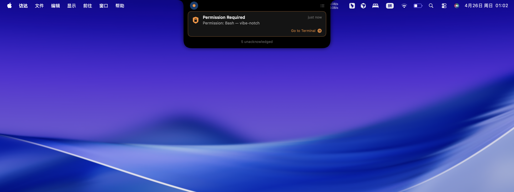
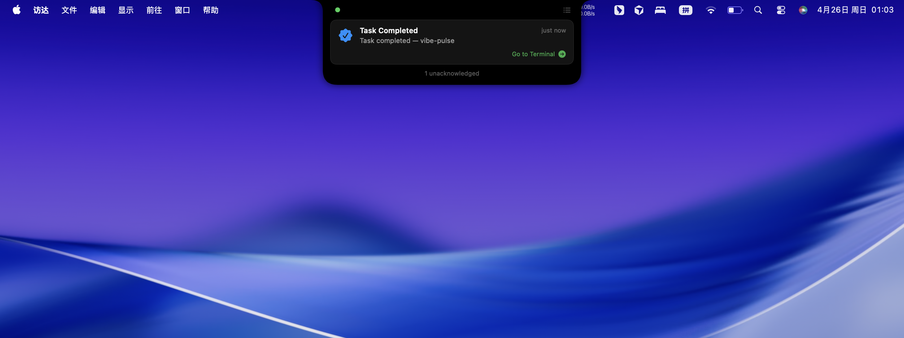
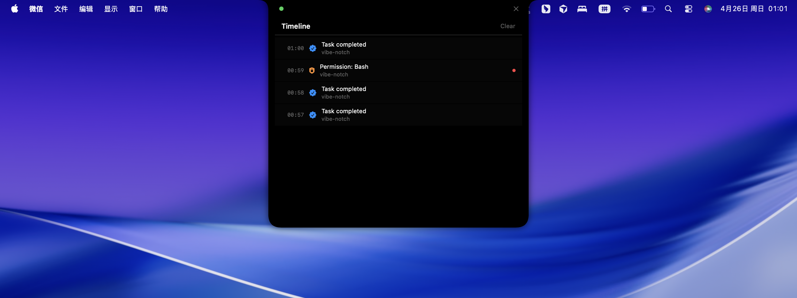

<div align="center">

# Vibe Pulse

**Claude Code CLI 智能通知中心**

一款 macOS 原生应用，将你的 MacBook 刘海屏变成灵动岛风格的 [Claude Code](https://docs.anthropic.com/en/docs/claude-code) 通知中心。实时推送权限请求和任务完成通知 —— 无需时刻盯着终端。

[](https://swift.org)
[](https://www.apple.com/macos/)
[](LICENSE)

[English](README.md) | 中文

</div>

---

## 截图预览

<table>
  <tr>
    <td align="center"><br /><b>空闲状态</b><br />绿色圆点 —— 所有会话已完成</td>
    <td align="center"><br /><b>处理中</b><br />蓝色呼吸圆点 —— Claude 正在工作</td>
  </tr>
  <tr>
    <td align="center"><br /><b>权限请求</b><br />橙色常驻卡片 —— 等待审批</td>
    <td align="center"><br /><b>任务完成</b><br />绿色卡片 —— 3 秒后自动收起</td>
  </tr>
  <tr>
    <td align="center" colspan="2"><br /><b>通知时间线</b><br />点击刘海区域浏览近期事件</td>
  </tr>
</table>

---

## 为什么需要 Vibe Pulse？

用 Claude Code 进行 vibe coding 时，你经常在多任务之间切换 —— 查文档、看设计稿、或者去倒杯咖啡。与此同时，Claude 可能正在：

- 等你批准一个命令的执行权限
- 完成了任务，等你下一步指令
- 向你提问

**Vibe Pulse 替你盯着 Claude Code**，通过 MacBook 刘海区域即时推送通知，让你不错过任何重要事件。

## 目标用户

- 日常使用 Claude Code CLI 进行自动化编码（vibe coding）的开发者
- 习惯在 Claude Code 运行时切换到浏览器、文档、聊天等其他应用的开发者
- 使用 MacBook（带刘海屏）的 macOS 用户

## 核心功能

### 智能事件检测

通过 Claude Code 的 [Hooks 系统](https://docs.anthropic.com/en/docs/claude-code/hooks) 自动捕获事件：

| 事件 | 检测方式 |
|---|---|
| 权限请求 | Claude Code `PermissionRequest` Hook |
| 任务完成 | Claude Code `Stop` Hook |
| Claude 提问 | `Notification` Hook（等待输入） |
| 测试通过 | 正则分析 stdout（pytest、Jest、XCTest、Go test、cargo test） |

### 三级通知体系

| 级别 | 行为 | 提示音 | 典型场景 |
|---|---|---|---|
| **静默** | 仅记录到时间线 | 无 | 测试通过 |
| **提醒** | 弹出卡片，3 秒自动收起 | 轻提示音 (Tink) | 任务完成、Claude 提问 |
| **警告** | 常驻卡片，直到用户操作 | 强提示音 (Sosumi) | 权限请求 |

### 动态状态指示灯

刘海区域的状态圆点实时反映当前状态：

| 颜色 | 含义 |
|---|---|
| 🟢 绿色 | 空闲 / 任务完成 |
| 🔵 蓝色 | Claude 正在处理 |
| 🟠 橙色 | 等待权限审批 |
| ⚪ 灰色 | 无活跃会话 |

### 智能免打扰

当你正在终端中操作时，Vibe Pulse 自动静默 —— 你已经在看 Claude 工作了，不需要重复通知。

### 一键跳转终端

每张通知卡片都有「Go to Terminal」按钮，一键跳转到对应 Claude 会话所在的终端窗口或 tmux 面板。

### 多会话追踪

同时追踪多个 Claude Code 会话，每个会话独立维护状态，刘海始终显示所有会话中最紧急的状态。

## 支持环境

**终端：** Apple Terminal、iTerm2、Ghostty、Warp

**终端复用器：** tmux（自动检测面板）

**测试框架（通过检测）：** pytest、Jest、Vitest、Mocha、XCTest、Go test、cargo test、RSpec、PHPUnit 等（19 种模式）

## 快速开始

### 前置条件

- macOS 15.0 (Sequoia) 或更高版本
- Swift 6.0+
- 已安装 [Claude Code](https://docs.anthropic.com/en/docs/claude-code)

### 构建与运行

```bash
git clone https://github.com/LMseventeen/vibe-pulse.git
cd vibe-pulse
swift run VibePulse
```

首次启动时，Vibe Pulse 会自动将 Hooks 注册到 `~/.claude/settings.json`，无需手动配置。

### 验证安装

启动后，你会在 MacBook 刘海附近看到一个小状态圆点。打开一个 Claude Code 会话，圆点会变为绿色/蓝色，表示正在追踪。

## 架构

```
Claude Code CLI
     │
     ▼ (hooks)
┌─────────────┐     Unix Socket      ┌──────────────────┐
│  Hook 脚本   │ ──────────────────▶  │   Vibe Pulse App │
│  (Python)    │  /tmp/claude-pulse   │                  │
└─────────────┘       .sock           │  ┌────────────┐  │
                                      │  │  事件捕获   │  │
                                      │  └─────┬──────┘  │
                                      │        ▼         │
                                      │  ┌────────────┐  │
                                      │  │  事件分类   │  │
                                      │  └─────┬──────┘  │
                                      │        ▼         │
                                      │  ┌────────────┐  │
                                      │  │  通知队列   │  │
                                      │  └─────┬──────┘  │
                                      │        ▼         │
                                      │  ┌────────────┐  │
                                      │  │  刘海 UI    │  │
                                      │  └────────────┘  │
                                      └──────────────────┘
```

**零依赖。** 完全使用 Apple 原生框架构建（SwiftUI、AppKit、Combine），无任何第三方依赖。

### 关键设计决策

- **正则优于 LLM** —— 亚毫秒级 stdout 分析，使用模式匹配而非 AI 推理
- **Actor 并发模型** —— 使用 Swift Actor（`PulseStore`、`EventClassifier`、`NotificationQueue`）确保线程安全
- **通知去重** —— 5 秒指纹窗口防止通知风暴
- **独立 Socket** —— 与 Vibe Notch 隔离（`/tmp/claude-pulse.sock`），避免冲突

## 项目结构

```
vibe-pulse/
├── Package.swift
├── VibePulse/
│   ├── App/                    # 应用入口、窗口管理
│   ├── Core/                   # 事件监听、刘海几何计算、视图模型
│   ├── Models/                 # PulseEvent、NotificationCard、SessionPhase
│   ├── Services/
│   │   ├── Capture/            # Bash 输出分析器、事件流
│   │   ├── Classifier/         # 事件分类、模式规则
│   │   ├── Hooks/              # Socket 服务器、Hook 安装器
│   │   ├── Notification/       # 通知队列、提示音
│   │   ├── State/              # PulseStore（中心状态 Actor）
│   │   └── Terminal/           # 终端聚焦、tmux、进程树
│   ├── UI/                     # SwiftUI 视图、样式、组件
│   ├── Utilities/              # 终端可见性检测
│   └── Resources/              # Hook 脚本、资源文件
└── Tests/
    └── VibePulseTests/         # 69 个测试，4 个测试套件
```

## 测试

```bash
swift test
```

69 个测试覆盖：
- **BashOutputAnalyzer** —— 5 种测试框架的 stdout 正则匹配
- **EventClassifier** —— 事件类型与通知级别分配
- **NotificationQueue** —— 去重、节流、优先级排序
- **PatternRules** —— 测试/构建命令识别（19 种测试 + 16 种构建模式）

## 灵感来源

灵感来自 [Vibe Notch](https://github.com/LMseventeen/vibe-notch)。Vibe Pulse 将其从仅权限弹窗扩展为完整的 Claude Code 智能通知中心。

## 许可证

MIT License —— 详见 [LICENSE](LICENSE)。
